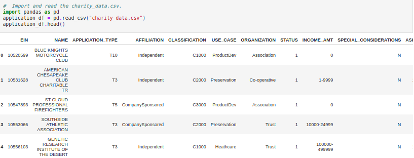
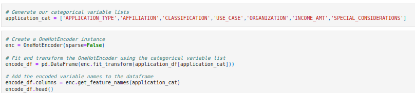
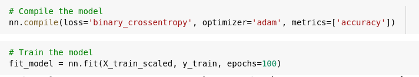

# Neural Network Charity Analysis


# Overview

You are working with Beks, a coworker of yours, at Alphabet Soup, an organization that helps fund Charity Organizations.  You are helping Beks to evaluate the CSV given to Beks by the Alphabet Soup's business team containing more than 34,000 organizations that have received funding from Alphabet Soup over the years.  You will be creating a machine learning algorithm, using neural networks to create a binary classifier that is capable of predicting wheter applicants will be successful if funded by Alphabet Soup.

The important metadata from this dataset captures the following about each organization:
* **EIN** and **NAME** - Identification columns
* **APPLICATION_TYPE** - Alphabet Soup application type
* **AFFILIATION** - Affiliated sector of industry
* **CLASSIFICATION** - Government organization classification
* **USE_CASE** - Use case for funding
* **ORGANIZATION** - Organization type
* **STATUS** - Active status
* **INCOME_AMT** - Income classification
* **SPECIAL_CONSIDERATIONS** - Specialconsideration for application
* **ASK_AMT** - Funding amount requested
* **IS_SUCCESSFUL** - Was the monty used effectively   

# Resources
* Data Sources: charity_data.csv
* Software: Google Colabority, Jupyter Notebook, Python 3.7, Pandas

# GitHub Application Link

<a href="https://jillibus.github.io/Neural_Network_Charity_Analysis">Neural Network Charity Analysis</a>

## Deliverable 1: Preprocessing the Data for a Neural Network Model

Data preprocessing involves transforming raw data to well-formed data sets so that data mining analytics can be applied. Raw data is often incomplete and has inconsistent formatting. The adequacy or inadequacy of data preparation has a direct correlation with the success of any project that involve data analyics.

Preprocessing involves both data validation and data imputation. The goal of data validation is to assess whether the data in question is both complete and accurate. The goal of data imputation is to correct errors and input missing values -- either manually or automatically through business process automation (BPA) programming.

Data preprocessing is used in both database-driven and rules-based applications. In machine learning (ML) processes, data preprocessing is critical for ensuring large datasets are formatted in such a way that the data they contain can be interpreted and parsed by learning algorithms. (https://www.techopedia.com/definition/14650/data-preprocessing)

Preprocessing of the Charity Data consists of:
1) Reading in the data set charity_data.csv into a pandas DataFrame.
2) Drop unnecessary columns that are not needed for the analysis, EIN and NAME.
3) Determine the number of unique values for each column.
4) Those with >10 unique values
    - Determine the number of data points for each unique value.
    - Plot the density to create a "cutoff" for rare categorical values to place in an "Others" bin
    - Validate your binning of this column worked
    - Repeat until all necessary columns are properly binned.
5) Generate a list of categorical variables.
6) Encode categorical variables using 'one-hot encoding' and place them in a new DataFrame, dropping the originals.
7) Merge the one-hot encoding DataFrame with the original DataFrame, and drop the originals.
8) Split the preprocessed data into features and target arrays.
9) Split the preprocessed data into training and testing datasets.
10) Standardize numerical variables using Scikit-Learn's _StandardScaler_ class, then scale the data.

_Lets see this in action, shall we?_

---
_1) Reading in the data set charity_data.csv into a pandas DataFrame._
  

---
_2) Drop unnecessary columns that are not needed for the analysis, EIN and NAME._


---
_3) Determine the number of unique values for each column._
    

---
_4) Those with >10 unique values, Determine number of data points, plot density, move to bins._  
**First Column with >10 Unique Values** - APPLICATION_TYPE 


  
**Second Column with >10 Unique Values** - CLASSIFICATION 


---
_5) Generate a list of categorical variables._


---
_6) Encode categorical variables using 'one-hot encoding' and place them in a new DataFrame, dropping the originals._


---
_7) Merge the one-hot encoding DataFrame with the original DataFrame, and drop the originals._


---
_8) Split the preprocessed data into features and target arrays._  
_9) Split the preprocessed data into training and testing datasets._  


---
_10) Standardize numerical variables using Scikit-Learn's _StandardScaler_ class, then scale the data._  


## For Deliverable 2: Compile, Train and Evaluate the Model

The next step in our machine learning process is to take our pre-processed datasets, now in a scaled dataframe, split into a Training and Testing setup and compile our model, train our machine with our training data, and then evaluate the model with our testing dataset.  

To do this we will follow the following steps:
1) Continue where we left off using our AlphabetSoupCharity.ipynb file.
2) Create a neural network model by assigning the number of input features and  nodes for each layer using Tensorflow Keras.
3) Create the first hidden layer and choose an appropriate activation function.
4) If necessary, add a second hidden layer with an appropriate activation function.
5) Create an output layer with an appropriate activation function.
6) Check the structure of the model.
7) Compile and train the model.
8) Create a callback that saves the model's weights every 5 epochs.
9) Evaluate the model using the test data to determine the loss and accuracy.
10) Save and export your results to an HDF5 file, naming it AlphabetSoupCharity.h5.

_Like Deliverable 1 above, lets see this in action, shall we?_

---
**FIRST RUN**  
_1) Starting in the cell after we "Scaled The Data"_  
_2) Create a neural network model by assigning the number of input features and  nodes for each layer using Tensorflow Keras._  
_3) Create the first hidden layer and choose an appropriate activation function._  
_4) If necessary, add a second hidden layer with an appropriate activation function._  
_5) Create an output layer with an appropriate activation function._  
_6) Check the structure of the model._  


---
_7) Compile and train the model._  

      
---
_9) Evaluate the model using the test data to determine the loss and accuracy._  


---
**SECOND RUN**  
_1) Starting in the cell after we "Scaled The Data"_
_2) Create a neural network model by assigning the number of input features and  nodes for each layer using Tensorflow Keras._  
_3) Create the first hidden layer and choose an appropriate activation function._  
_4) If necessary, add a second hidden layer with an appropriate activation function._  
_5) Create an output layer with an appropriate activation function._  
_6) Check the structure of the model._ 


---
_7) Compile and train the model._   
_8) Create a callback that saves the model's weights every 5 epochs._  


---
_9) Evaluate the model using the test data to determine the loss and accuracy._  


---
_10) Save and export your results to an HDF5 file, naming it AlphabetSoupCharity.h5._  


---
## For Deliverable 3: Optimize your Model
At least 3 attempts if you can't get results over 75%
Noisy variables are removed from features (2.5 pt)
Additional neurons are added to hidden layers (2.5 pt)
Additional hidden layers are added (5 pt)
The activation function of hidden layers or output layers is changed for optimization (5 pt)
The model's weights are saved every 5 epochs (2.5 pt)
The results are saved to an HDF5 file (2.5 pt)


---
```

```


---
```

```


## For Deliverable 4: Results and Summary
### Results: 

* Data Preprocessing
  * What variable(s) are considered the target(s) for your model?
  * What variable(s) are considered to be the features for your model?
  * What variable(s) are neither targets nor features, and should be removed from the input data?
  
* Compiling, Training, and Evaluating the Model
  * How many neurons, layers, and activation functions did you select for your neural network model, and why?
  * Were you able to achieve the target model performance?
  * What steps did you take to try and increase model performance?

```

```


---
```

```


---
```

```
```

```
---
```

```
```

```


---


# Summary

Summarize the overall results of the deep learning model. Include a recommendation for how a different model could solve this classification problem, and explain your recommendation.


Let me know if you have any questions or need more information.

Thank you for your time.

Jill Hughes
